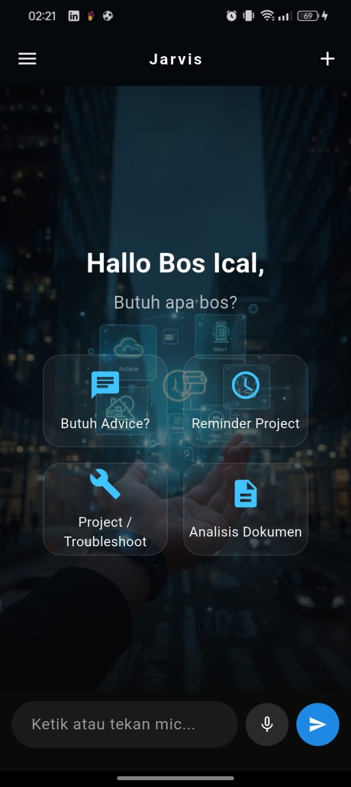
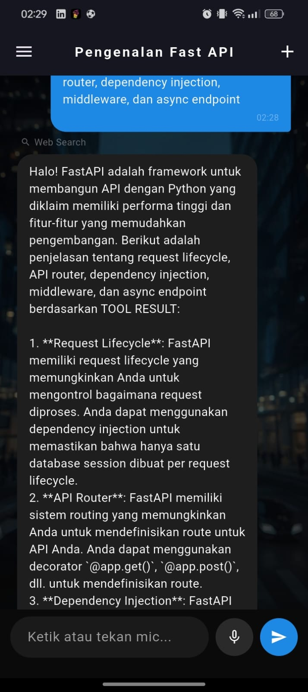
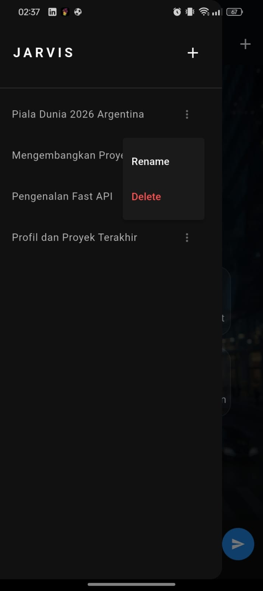
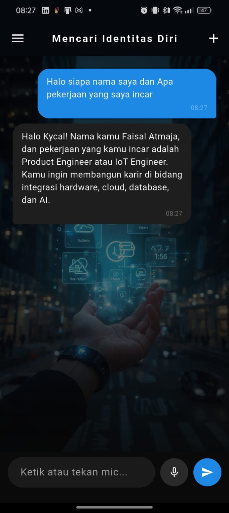
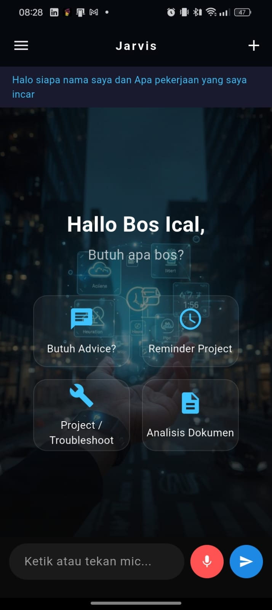

<div align="center">

# 🤖 JARVIS AI Assistant

An AI-powered personal assistant with Retrieval-Augmented Generation (RAG), memory, web search, voice interaction, and Flutter mobile interface.


</div>

---

# 📖 Overview

JARVIS is a full-stack AI Assistant inspired by modern AI systems such as ChatGPT and Claude.

This project combines a FastAPI backend with a Flutter mobile application to create an intelligent assistant capable of:

- 💬 Conversational AI
- 🧠 Long-term Memory
- 🌐 Web Search
- 📄 Knowledge Retrieval (RAG)
- 🎤 Voice Interaction
- 📂 Document Analysis
- 🔍 Semantic Search
- ☁ Cloud Deployment

---

# 🏗 Project Structure

```
Jarvis/
│
├── backend/          # FastAPI Backend
│
├── mobile/           # Flutter Mobile App
│
├── docs/
│   └── screenshots/
│
└── README.md
```

---

# ✨ Features

## Backend

- FastAPI REST API
- LangChain Integration
- PostgreSQL Database
- pgvector Vector Database
- Retrieval-Augmented Generation (RAG)
- Long-Term Memory
- Knowledge Base
- Semantic Search
- Web Search Tool
- File Upload & Document Processing
- Embedding Pipeline
- OpenRouter LLM Integration

---

## Mobile

- Flutter UI
- Chat Interface
- Voice Input
- Conversation History
- Sidebar Management
- Markdown Rendering
- Glassmorphism UI
- Background AI Theme

---

# 🖼 Application Preview

## Home

Main interface of JARVIS displaying quick action cards, AI assistant greeting, and chat input.



---

## Chat

Conversation interface showing AI responses with markdown rendering and contextual interactions.



---

## Sidebar

Conversation history management with rename and delete functionality.



---

## Memory

Demonstration of long-term memory capability where the assistant recalls stored user information across conversations.



---

## Voice Input

Voice interaction using speech-to-text for hands-free communication.



---

# ⚙ Backend Tech Stack

- Python
- FastAPI
- LangChain
- PostgreSQL
- pgvector
- SQLAlchemy
- OpenRouter API
- Uvicorn

---

# 📱 Mobile Tech Stack

- Flutter
- Dart
- HTTP
- Markdown Widget
- Speech To Text
- Material Design

---

# 🚀 Getting Started

## Clone Repository

```bash
git clone https://github.com/icalkyrie-dotcom/Jarvis.git

cd Jarvis
```

---

# Backend Setup

```bash
cd backend

python -m venv venv

venv\Scripts\activate

pip install -r requirements.txt

uvicorn main:app --reload
```

Backend runs on

```
http://localhost:8000
```

---

# Mobile Setup

```bash
cd mobile

flutter pub get

flutter run
```

---

# Architecture

```
Flutter App
      │
      ▼
FastAPI Backend
      │
      ▼
 LangChain
      │
      ▼
 OpenRouter LLM
      │
 ┌────┴────┐
 │         │
 ▼         ▼
Memory    RAG
 │         │
 ▼         ▼
Postgres  pgvector
```

---

# Future Improvements

- Authentication
- Multi-user Support
- Image Understanding
- Streaming Response
- Docker Deployment
- Admin Dashboard
- Desktop Version
- Better Voice Assistant

---

# License

This project is licensed under the MIT License.

---

# 👨‍💻 Author

**Faisal Atmaja**

- LinkedIn: https://www.linkedin.com/in/faisal-atmaja-b38330356
- Email: faisalatmaja30@gmail.com
- GitHub: https://github.com/icalkyrie-dotcom
- 
